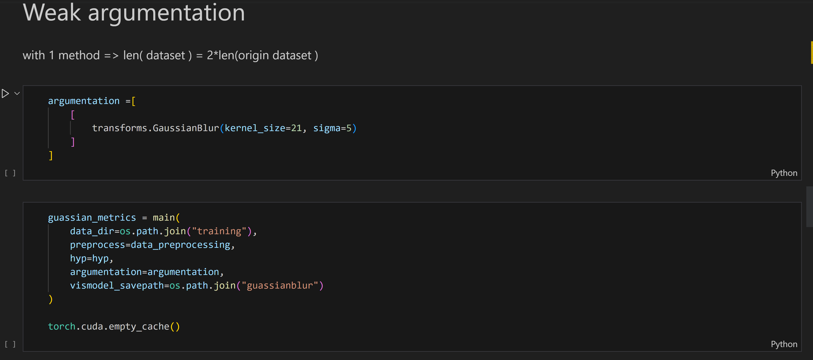
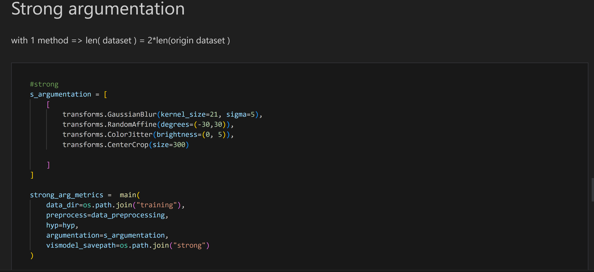
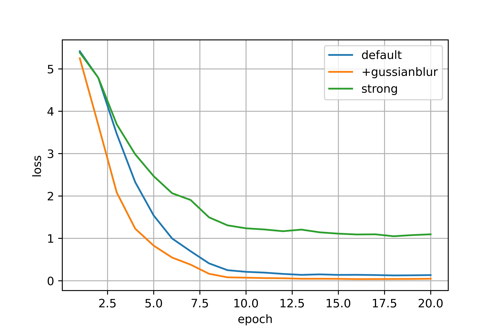
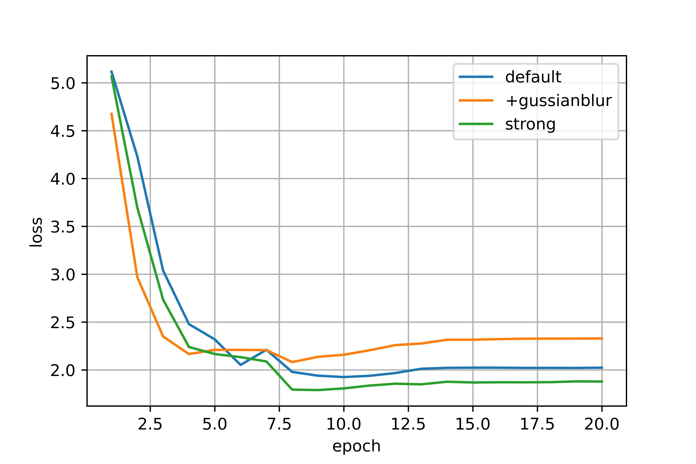

# Assigment 6 報告
資工四 408410098 蔡嘉祥

## 程式碼

我是將 dataset 上傳到 server 上面來執行的，沒有使用 google colab
執行的 notebook 我附在資料夾 ML_HW6_sample_code.ipynb 裡面

### Data Argumentation

我將 main() 做了修改:

- Create Argumented ImageFolder() :

     

- 加入原始資料集 :

    為了將 argumentation 後的圖片加入到原本的 training datasets 裡面，我使用 ```torch.utils.data.ConcatDataset()```
    來達成。主要概念就是將一個 ```ImageFolder()``` list 結合起來。

    我只有使用一種 argumentation，所以training data 變為兩倍。

#### Weak argumentation:
- 程式片段:
  

  使用 guassianblur()，將影像變模糊。

#### Strong argumentation:

我將 4 種 transform methods 合併來建立 1 個 strong argumentation (所以 training datasets 的數量還是一樣為原始的 2 倍)
- 程式片段:
    

### 比較結果 

#### training loss:



可以看到使用 strong argumentation 後，training loss 明顯較大，是因為有很多被大量修改的圖片進入 trianing dataset 中，所以比較「多元」，更接近有許多不同 data 的情況；而 weak argumentation 則可能生成出與原始較相似 ( 相較於 strong ) 的資料，所以跟 default 情況差不多。

#### validation loss :



依據我的實驗結果，在 validation 上，使用 strong argumentation 的情況表現較好，應該是由於 dataset 相較多元，所以比較不會 overfitting 。

#### Best Validation Accuracy:

|default|weak argu.|strong argu.|
|-|-|-|
|0.5586|0.5799|0.5875|

其實我有跑過幾次，好像數值大小關係每次不一定都是 strong argumentation 最大、 defualt 最小。

綜合來看，感覺training data 加入 argumentated 的 data 後，是有加分，但感覺影像不大。也有可能是我只擴充 1 倍的關係。
