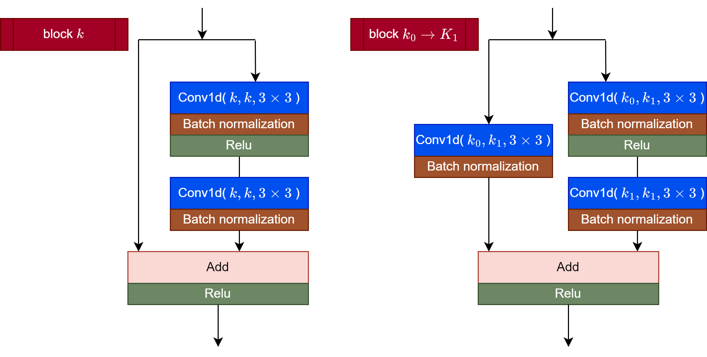
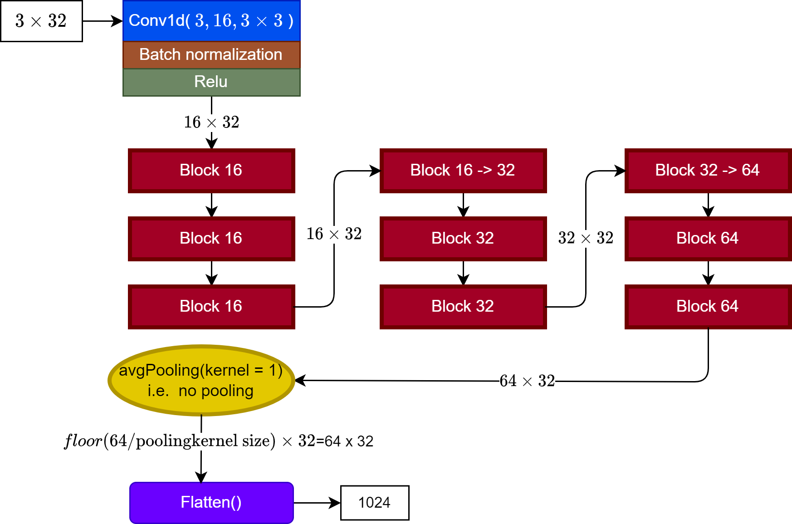
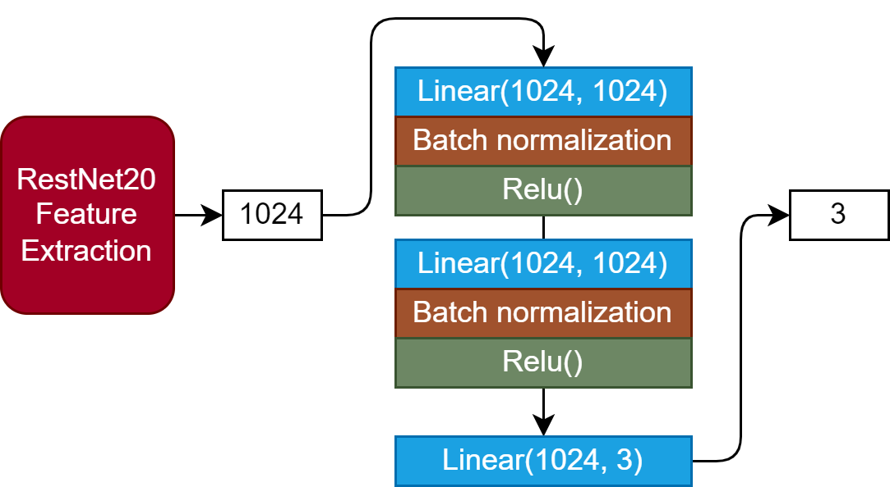

## Competition:
https://www.kaggle.com/competitions/tlvmc-parkinsons-freezing-gait-prediction


## Model 架構:

### Feature Extraction : 1D Convolution

之所以使用 convolution 的原因是因為資料為一個 1 dimension 3 channel 的時序信號 ( window size 沿用原始設置 32 )，而 1d convolution 可以拿來做訊號的處理，所以我們想用 1D convolution layers 來取代 Linear layers 當作我們的 Feature Extraction operator。


由於 convoluton layers 會使參數增多 (每個 kernel 都要學)，所以我們打算使用 Residual Network 的架構。


最終，我們參考 ```RestNet20``` 架構，把其中 2D convolution 改成 1D convolution



** 原本的架構當 out channel 數量提升之時，旁邊的 shortcut kernel size 是 $1\times 1$；我們這邊不小心誤用成 $3\times 3$ 了

Feature Extraction model



### Classifier : Vanilla Linear Layers with activation function

把使用 kernel 抓取特徵完的 features 送進 $k$ 層的 Linear Layers 來作為 classifier 。
這邊我們選用了 2 層 Linear layers with activation function 在加最後 output layer 當作我們的分類器。



